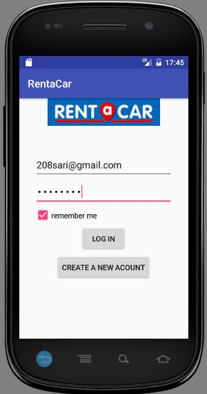
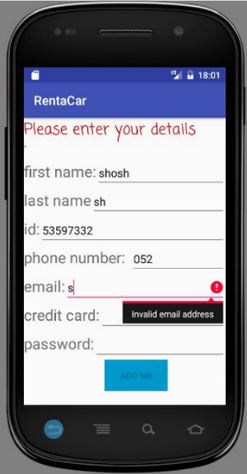
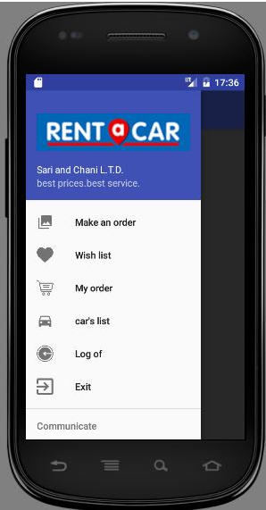
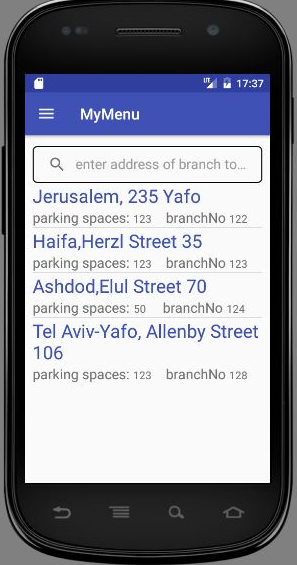

# Rent a Car Apps
This application manage rental cars. Including client and server apps. Data saved in MySql database.

## Server app:
* Store the company data: cars, branchs and users data
* Manage the rental

## Client app:
* Login
* Search for branch
* Pay when finish the rental

## ScreenShots:
### Client App:

### Server App:

### Prerequisites:
* Java
* Android studio

